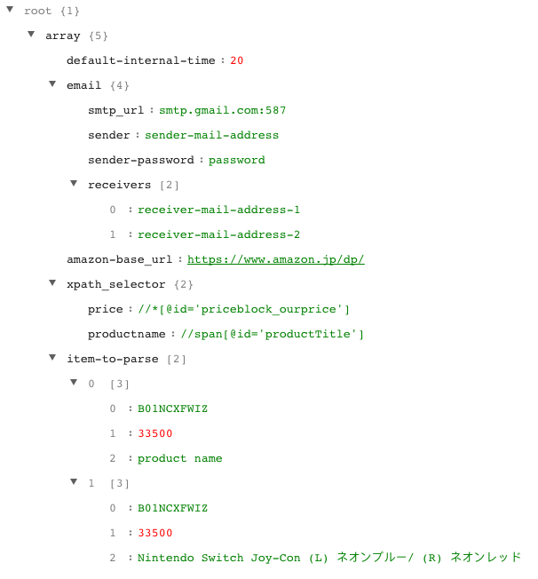
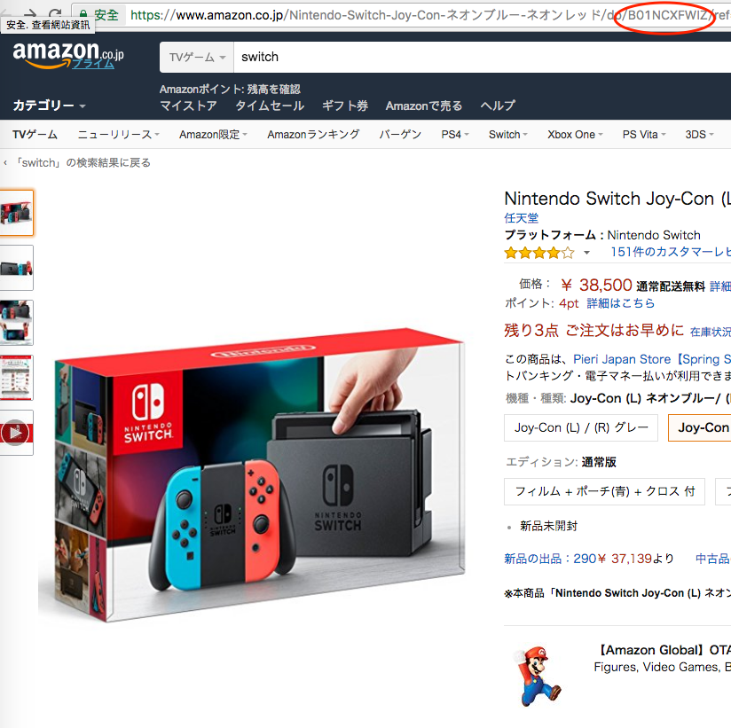
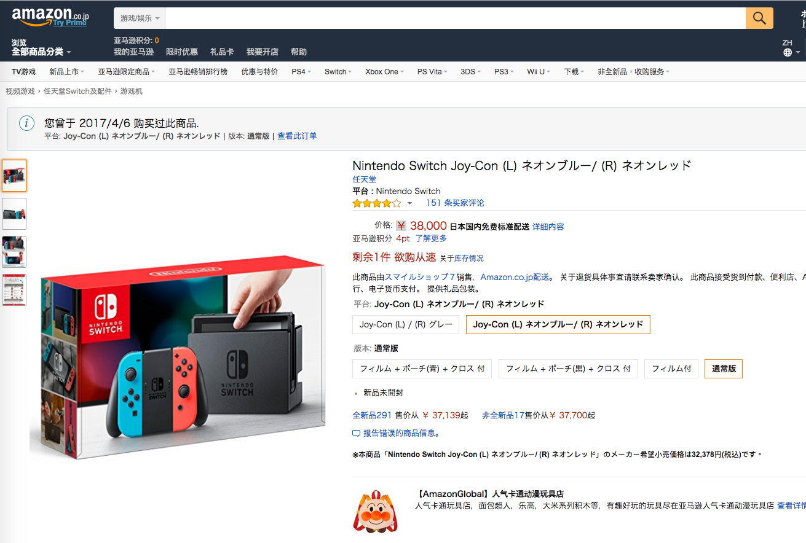
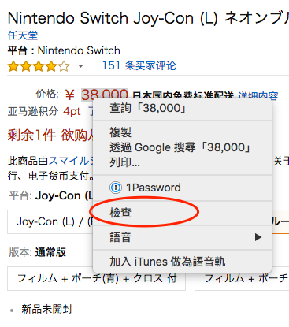
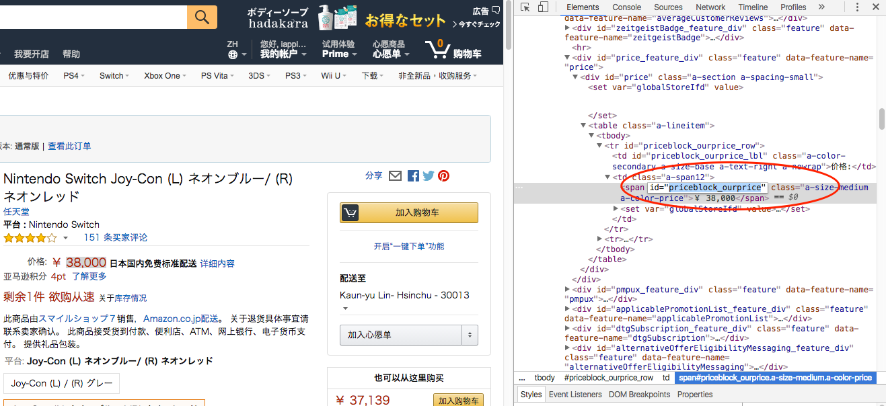
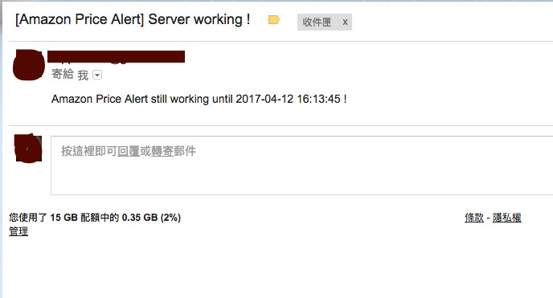
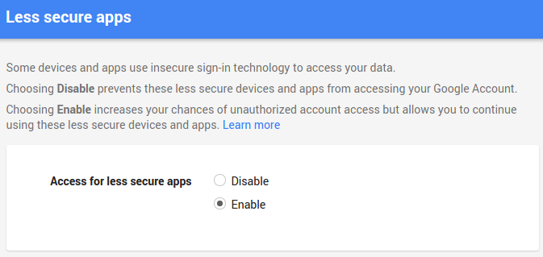

# Amazon-Price-Alert


This script will send you an email when the price for specific items you followed on Amazon drops beneath a certain price you set.


**You can parse the price without Amazon API !**


## Installation
`pip install -r requirements.txt`

Then you need to edit the config.json first,

	1. email → sender, sender-password, receivers
	2. amazon-base_url (change to amazon store where your target item is)
	3. item-to-parse (add item id which you want to track)


After installed required package and finished config.json, you can use it by
`python crawler.py`

## Required Accounts
```text
1. Google Mail
```
## Config file
Put *config.json* in same folder as code, or you can configure the path by '-c' argument



#### default-internal-time
Sleep time between each check (seconds)

#### email
- sender : sender Google mail account
- sender-password : sender Google mail account password 
- receivers : receivers' mail, you can add as much as you want
 
Remember to close the setting of [Less Secure Apps](https://www.google.com/settings/security/lesssecureapps)


#### amazon-base url
Get url from your amazon of you location. For example : URL of Amazon JP is `https://www.amazon.co.jp/dp/`
 

#### item-to-parse
You need to put item ID and expected price here.


### how can I get item ID from Amazon?
#### Step 1.
Search your item and go into the item page.

Example item: Nintendo Switch

#### Step 2.
You can find the item id in the url


### Why my script can't get price from Amazon?
There may be two problem of it.

1.Your ip was banned by Amazon

	Change your IP or wait for unban.


2.The item selector changed


### How to change selector? 
#### Step 1.
Search your item and go into the item page.

Example item: Nintendo Switch

#### Step 2.
Use your mouse and right click on the price text and choose inpector

#### Step 3.
You will see the selector id of price text in the inspector window

## Email Layout
Server will send 3 kinds of mails to receiver

1. **Server working notification mail**
	
	Send every day for reminding you server still working
	
	
2. **Server shutdown notification mail**
	
	Server shutdown mail for reminding you to restart. Most reason of the problem is the server banned by Amazon. You can restart it after 30 minutes.
	
2. **Price dropped mail**
	You can 
	
	
	

## Limitation
#### Checking interval time limitation
This code use some skill preventing banned by Amazon. However, the best interval time between each time of price checking is around 15 minutes.

#### Google mail account security
[Less Secure Apps](https://www.google.com/settings/security/lesssecureapps)

Using Google smtp server to send mail, you need to enable less secure apps in your account for using it.


## Dependencies
```text
Python 2
lxml
json
requests
smtplib
MIMEText
ConfigParser, argparse, urlparse
```

## Future feature
```text
1. Direct message notification via Twitter
```