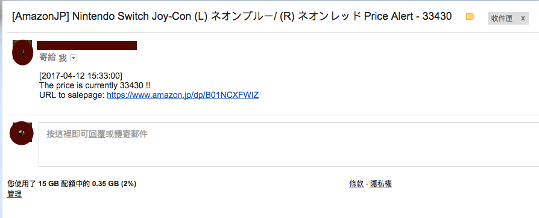

# Amazon-Price-Alert
This script will send you an email when the price for specific items you followed on Amazon drops beneath a certain price you set.

**You can parse the price without Amazon API !**


## Installation
`pip install -r requirements.txt`

## Required Accounts
```text
1. Google Mail
```
## Config file
Put *config.json* in same folder as code, or you can configure the path by '-c' argument

###how can I get my item ID from Amazon?


## Email Layout
Server will send 3 kinds of mails to receiver

1. **Server working notification mail**
	
	Send every day for reminding you server still working
	
	
2. **Server shutdown notification mail**
	
	Server shutdown mail for reminding you to restart. Most reason of the problem is the server banned by Amazon. You can restart it after 30 minutes.
	
2. **Price dropped mail**
	When the price of item you followed drop beneath your expected price, server will send notified mail to you.
	
	
	

## Limitation
####Checking interval time limitation
This code use some skill preventing banned by Amazon. However, the best interval time between each time of price checking is around 15 minutes.

####Google mail account security
[Less Secure Apps](https://www.google.com/settings/security/lesssecureapps)

Using Google smtp server to send mail, you need to enable less secure apps in your account for using it.


## Dependencies
```text
Python 2
lxml
json
requests
smtplib
MIMEText
ConfigParser, argparse, urlparse
```

## Future feature
```text
1. Direct message notification via Twitter
```